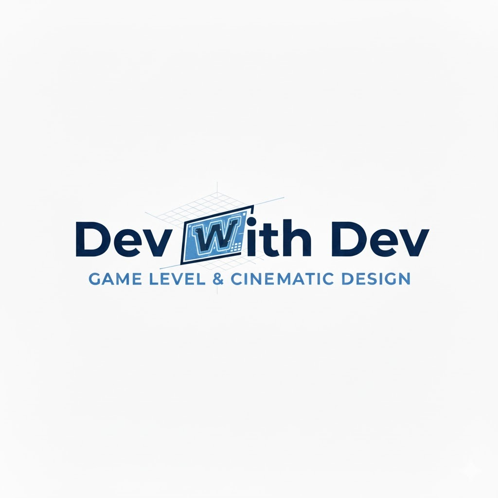

<!-- ===== TOPBAR ===== -->

  

   <a href="./index.html" class="brand">
     
     Dev With Dev
   </a>

    

      

        <a href="mailto:devrajssingh@yahoo.com">Email</a>
        <a href="https://www.linkedin.com/in/devraj-singh-b62971261" target="_blank" rel="noopener noreferrer">LinkedIn</a>
        <a href="https://devidog34.itch.io/" target="_blank" rel="noopener noreferrer">Itch.io</a>
      

      

        <a href="#level-design">Level Design</a>
        <a href="#cinematic-design">Cinematic Design</a>
      

    

  

  <!-- HERO -->
  

    <h1>Devraj "Dev" Singh</h1>
    
Game Designer focused on systems, level design, and cinematic gameplay experiences.

  

  <!-- LEVEL DESIGN -->
  

    
Level Design

    

      

        
        

          <h3>Level Design Experiments</h3>
          
Player flow, spatial storytelling, and environment-driven pacing.

          <a class="link" href="./level-design.html">View Case Study →</a>
        

      

    

  

  <!-- CINEMATIC DESIGN -->
  

    
Cinematic Design

    

      <!-- MANTA VIDEO CARD -->
      

        

          

          <iframe 
            class="video"
            src="https://www.youtube-nocookie.com/embed/-GJStUShhT0?start=53&autoplay=1&mute=1&controls=0&playsinline=1&loop=1&playlist=-GJStUShhT0&modestbranding=1"
            allow="autoplay; encrypted-media">
          </iframe>

        

        

          <h3>Manta Ray</h3>
          
Environmental interaction and movement-driven cinematic gameplay.

          <a class="link" href="./manta-ray.html">View Case Study →</a>
        

      

      <!-- COMBAT -->
      

        
        

          <h3>Combat Prototype</h3>
          
Cinematic combat flow, sequencing, and player feedback systems.

          <a class="link" href="./combat-prototype.html">View Case Study →</a>
        

      

    

  

