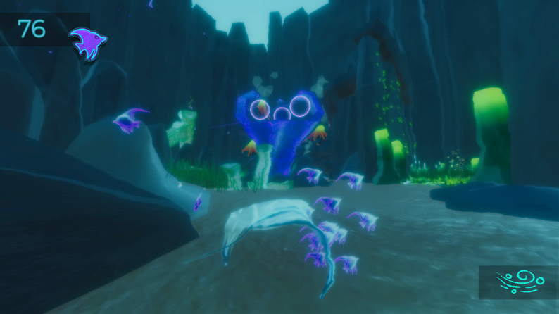

<!-- HEADER -->

  

    <a href="./index.html" class="brand">
      
      Dev With Dev
    </a>

    

      

        <a href="mailto:devrajssingh@yahoo.com">Email</a>
        <a href="https://www.linkedin.com/in/devraj-singh-b62971261" target="_blank">LinkedIn</a>
        <a href="https://devidog34.itch.io/" target="_blank">Itch.io</a>
      

      

        <a href="./level-design.html">Level Design</a>
        <a href="./cinematic-design.html">Cinematic</a>
      

    

  

  <!-- HERO (COMPACT) -->
  

    <h1>Devraj "Dev" Singh</h1>
    
Game Designer focused on gameplay systems, player feel, and immersive interaction.

  

  <!-- PROJECTS -->
  

    
Projects

    

      <!-- Abyssal Shade -->
      

        

          
          <iframe class="video"
            src="https://www.youtube-nocookie.com/embed/-GJStUShhT0?start=53&autoplay=1&mute=1&controls=0&loop=1&playlist=-GJStUShhT0">
          </iframe>
        

        

          <h3>Abyssal Shade</h3>
          
Underwater gameplay system with environmental interaction.

          <a class="link" href="./abyssal-shade.html">View Game →</a>
        

      

     <!-- The Lone Town -->
      

        
        

          <h3>The Lone Town</h3>
          
Atmospheric environment focused on exploration and mood.

          <a class="link" href="#">View Game →</a>
        

      

      <!-- S.O.R.N -->
      

        
        

          <h3>S.O.R.N</h3>
          
Experimental gameplay systems and combat interactions.

          <a class="link" href="#">View Game →</a>
        

      

      <!-- Ripple Rescue -->
      

        
        

          <h3>Ripple Rescue</h3>
          
Mechanic-driven gameplay focused on player movement.

          <a class="link" href="#">View Game →</a>
        

      

      <!-- David’s Mighty Men -->
      

        
        

          <h3>David’s Mighty Men</h3>
          
Team-based gameplay and character interaction systems.

          <a class="link" href="#">View Game →</a>
        

      

    

  

